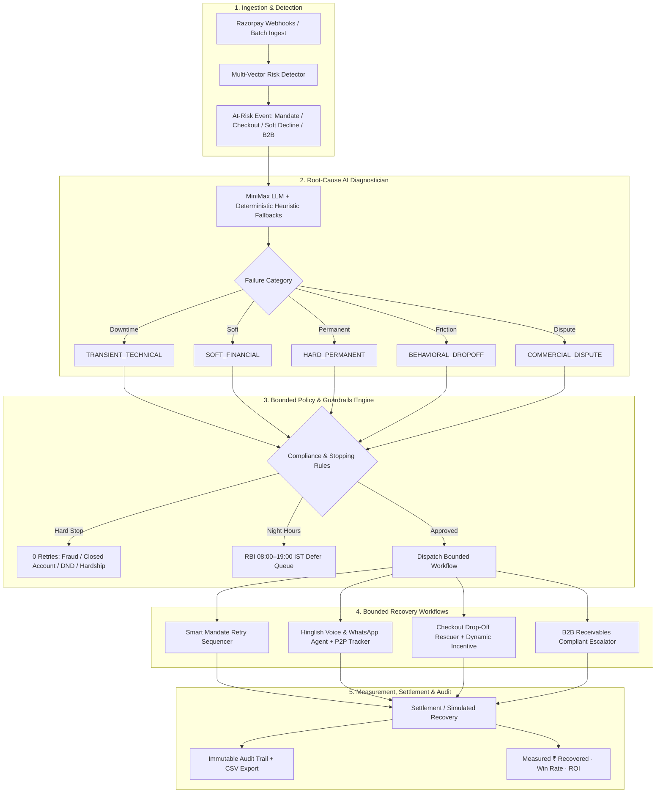

# RazorRevive — Autonomous AI Revenue Recovery Engine

**Razorpay Buildathon 2026 · AI Revenue Recovery Track**
> *"Find revenue that's slipping away and win it back."*

RazorRevive pairs an agentic LLM diagnostic brain (MiniMax-M3 via GMI) with a deterministic, rule-bounded recovery engine to win back revenue lost across the Indian commerce lifecycle — recurring mandate failures, checkout drop-offs, soft declines, and B2B receivables — while enforcing RBI compliance, anti-harassment stopping rules, and a full immutable audit trail.

---

## 1. The Problem: Revenue Leaks Everywhere

| Leak | Cause | Naive dunning result |
|---|---|---|
| **UPI Autopay / eNACH mandate failures** (20–30% initial debit failure) | Bank gateway downtime, salary-cycle mismatches, daily UPI caps | Blind 02:00 AM retries exhaust quota, incur bounce penalty fees, churn subscriptions |
| **Magic Checkout drop-offs** | Shipping fee shock, OTP timeout, method unavailability | Generic email → ~5% win-back |
| **Soft declines** | Issuer node degradation (e.g. SBI 78% uptime windows) | Immediate retries trigger fraud flags / customer frustration |
| **B2B receivables (30–90 days)** | Approval bottlenecks, reconciliation friction | Aggressive chasing alienates high-LTV enterprise clients |

## 2. The Architecture



### Key subsystems

| Subsystem | File | What it does |
|---|---|---|
| AI Root-Cause Diagnostician | `backend/app/core/diagnostics.py` | LLM structured diagnosis (`failure_mode`, `confidence`, `rationale`, `recommended_action`) with deterministic rule-map fallback — a transient LLM timeout never blocks recovery |
| Guardrails & Compliance Engine | `backend/app/core/policy_guardrails.py` | RBI 08:00–19:00 IST contact hours, hard-stop on permanent declines, max 3 touchpoints / 7 days, DND + Hinglish hardship keyword detection ("paise nahi", "jobless") |
| Smart Mandate Retry Sequencer | `backend/app/interventions/mandate_sequencer.py` | Holds retries during issuer degradation, targets 09:30 AM low-traffic clearing windows, salary-cycle (28th–5th) liquidity boost |
| Hinglish Agent + P2P Tracker | `backend/app/interventions/hinglish_agent.py` | Bilingual conversational recovery; extracts promises like *"Kal shaam 5 baje"*, freezes dunning, schedules polite reminders; handles disputes/DND gracefully |
| Checkout Drop-Off Rescuer | `backend/app/interventions/checkout_rescuer.py` | Margin-bounded dynamic incentives (5–7% capped, free shipping) with 3-hour expiry links |
| B2B Receivables Chaser | `backend/app/interventions/b2b_chaser.py` | 3-stage escalation ladder with Razorpay Smart Collect virtual accounts and split-payment options |
| Batch Simulation Engine | `backend/app/simulation/` | Realistic Indian merchant batches (50–500 txns), channel-coherent failure presets, side-by-side **Baseline vs RazorRevive** with rigorous accounting |
| Immutable Audit Ledger | `backend/app/core/audit_logger.py` | Every decision chain logged: diagnosis, compliance certification, intervention, settlement ref; one-click CSV export |

## 3. Quick Start

### Prerequisites
- Python 3.10+
- Node.js 18+

### Run (single command)

```bash
python run.py
```

Boots the FastAPI backend (`http://127.0.0.1:8000`) and the Vite frontend (`http://localhost:5173`), auto-installing dependencies on first run. Dashboard opens automatically.

<details>
<summary>Manual setup (alternative)</summary>

```bash
# Backend
pip install -r requirements.txt
python -m uvicorn backend.app.main:app --host 0.0.0.0 --port 8000

# Frontend (separate terminal)
cd frontend
npm install
npm run dev
```

Production single-port mode: `cd frontend && npm run build`, then the backend serves the built SPA at `http://127.0.0.1:8000`.
</details>

### Environment
Copy `.env.example` → `.env`:

```env
GMI_BASE_URL=https://api.gmi-serving.com/v1
GMI_API_KEY=<your key>
GMI_MODEL=MiniMaxAI/MiniMax-M3
```

If the key is missing or the LLM times out, the deterministic heuristic engine takes over — recovery never blocks.

## 4. The Dashboard

1. **Batch Simulator & ROI** — Configure batch size (50–500) and vertical mix (SaaS / D2C / B2B / OTT). Run side-by-side Baseline vs RazorRevive and watch measured ₹ recovered, incremental lift, operating cost, and ROI. On a representative mixed batch the AI stack recovers ~50% of at-risk revenue vs ~15% for naive blind dunning (measured across 20 seeded batches; single runs vary with batch composition).
2. **Hinglish Voice & P2P Agent** — Live chat with "Priya". Try *"Kal shaam 6 baje payment karunga"* and watch the Promise-to-Pay tracker extract the date, freeze dunning, and schedule the reminder. Play Hinglish audio via Web Speech API.
3. **Mandate Sequencer & Bank Health** — Live issuer uptime grid (HDFC 99.4% vs SBI 78.2%) plus a naive-vs-smart retry timeline.
4. **Compliance Audit Ledger** — Filterable immutable decision logs; expand any row for full LLM reasoning and compliance certification; export CSV.
5. **Razorpay Webhook Sandbox** — Fire synthetic `payment.failed` / `subscription.halted` events and watch real-time diagnosis and bounded action.

## 5. API Surface

| Endpoint | Method | Purpose |
|---|---|---|
| `/api/health` | GET | Service health |
| `/api/batch/simulate` | POST | Run batch simulation (`{batch_size, vertical_mix, enable_llm}`) |
| `/api/batch/latest` | GET | Latest batch summary (auto-runs 100-txn demo batch on first call) |
| `/api/agent/chat` | POST | Hinglish agent conversational turn |
| `/api/agent/p2p` | GET | Promise-to-Pay registry |
| `/api/agent/bank-health` | GET | Issuer bank uptime grid |
| `/api/agent/scenarios` | GET | Preset demo scenarios |
| `/api/webhook/razorpay` | POST | Ingest Razorpay webhook → full recovery pipeline |
| `/api/webhook/samples` | GET | Sample webhook payloads |
| `/api/audit` | GET | Query audit trail (status / intervention / category / search) |
| `/api/audit/csv` | GET | Download audit trail as CSV |
| `/api/audit/stats` | GET | Aggregate audit statistics |

Interactive docs: `http://127.0.0.1:8000/docs`

## 6. Compliance & Guardrails (RBI-aligned)

- **Contact hours:** No voice/SMS nudges outside 08:00–19:00 IST; overnight actions queue for the next morning window.
- **Hard stops (0 retries):** Expired cards, closed accounts, fraud flags, revoked mandates.
- **Touch ceiling:** Max 3 touchpoints per 7-day window — anti-harassment.
- **Opt-out & hardship:** Instant halt on *"stop"*, *"mat phone karo"*, *"paise nahi"*; escalates to human support.
- **Pre-debit notification:** 24h pre-debit notice verified before scheduled mandate retries.

## 7. Verification

### Automated tests (23 tests)

```bash
python -m pytest backend/tests -v
```

- `test_diagnostics.py` — classification accuracy across all 5 failure categories
- `test_guardrails.py` — RBI hours, hard stops, DND, hardship, touch ceiling
- `test_p2p_tracker.py` — Hinglish intent extraction & promise date parsing
- `test_batch_simulation.py` — accounting integrity, channel coherence, baseline harassment rules, audit counts

### Manual demo flow
1. `python run.py` → dashboard opens
2. Run **100-txn batch** → observe ~₹ lakhs at risk, AI stack recovering roughly 3× the naive baseline, guardrail stops celebrated as range-safety
3. Chat with the Hinglish agent → reply *"Kal subah 10 baje salary aayegi tab bhej dena"* → P2P tracker schedules the reminder
4. Audit tab → filter "Stopped (Guardrail)" → confirm zero dunning on stolen-card cases → download CSV
5. Webhook sandbox → fire `payment.failed` → watch immediate diagnosis + action

## 8. Tech Stack

- **Backend:** FastAPI, Pydantic v2, httpx (async LLM calls), pytest
- **Frontend:** React 19, TypeScript, Vite, Tailwind CSS v4, lucide-react
- **LLM:** MiniMaxAI/MiniMax-M3 via GMI OpenAI-compatible endpoint (with deterministic fallback)
- **Zero paid telephony:** Web Speech API synthesizes Hinglish voice in-browser

## 9. Project Structure

```
RevenueRecovery/
├── run.py                    # Single-command boot (backend + frontend)
├── requirements.txt
├── .env.example
├── backend/
│   ├── app/
│   │   ├── main.py           # FastAPI entrypoint + SPA static mount
│   │   ├── config.py         # Settings & compliance constants
│   │   ├── core/             # engine, diagnostics, guardrails, audit
│   │   ├── interventions/    # mandate, hinglish, checkout, b2b
│   │   ├── simulation/       # generator + baseline-vs-AI runner
│   │   ├── models/schemas.py # Pydantic contracts
│   │   └── api/              # batch, agent, webhook, audit routes
│   └── tests/                # 23 pytest cases
└── frontend/
    └── src/
        ├── App.tsx           # Executive dashboard shell
        ├── components/       # 7 dashboard views
        └── services/api.ts   # Typed API client
```

---

**RazorRevive** — *Don't just identify the problem. Measure the money won back, prove the compliance, and audit every decision.*
