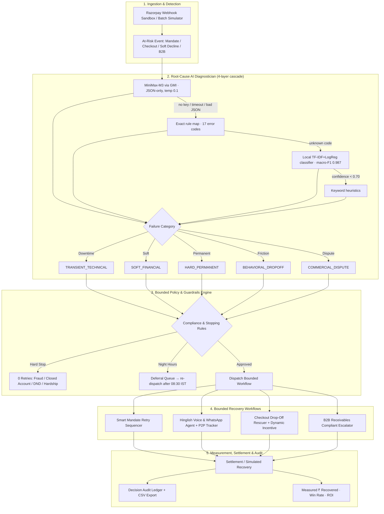

# RazorRevive — Autonomous AI Revenue Recovery Engine

**Razorpay Buildathon 2026 · AI Risk Manager Track**
> *"Find revenue that's slipping away and win it back."*

RazorRevive pairs an agentic LLM diagnostic brain (MiniMax-M3 via GMI) with a deterministic, rule-bounded recovery engine to win back revenue lost across the Indian commerce lifecycle — recurring mandate failures, checkout drop-offs, soft declines, and B2B receivables — while enforcing RBI compliance, anti-harassment stopping rules, and a full decision audit trail.

> **Honesty note:** this is a demo build. Intervention *outcomes* are simulated with calibrated success probabilities, bank "health" is a static demo registry, and nothing calls the real Razorpay API. The diagnosis cascade, compliance engine, deferral dispatcher, audit ledger, and batch accounting are genuinely implemented and tested. See §7 for the full real-vs-simulated breakdown.

---

## 1. The Problem: Revenue Leaks Everywhere

| Leak | Cause | Naive dunning result |
|---|---|---|
| **UPI Autopay / eNACH mandate failures** (20–30% initial debit failure) | Bank gateway downtime, salary-cycle mismatches, daily UPI caps | Blind 02:00 AM retries exhaust quota, incur bounce penalty fees, churn subscriptions |
| **Magic Checkout drop-offs** | Shipping fee shock, OTP timeout, method unavailability | Generic email → ~5% win-back |
| **Soft declines** | Issuer node degradation (e.g. SBI 78% uptime windows) | Immediate retries trigger fraud flags / customer frustration |
| **B2B receivables (30–90 days)** | Approval bottlenecks, reconciliation friction | Aggressive chasing alienates high-LTV enterprise clients |

## 2. The Architecture



### The diagnosis cascade (never blocks, in priority order)

1. **LLM** — `llm_adapter` POSTs to the GMI OpenAI-compatible endpoint (`MiniMaxAI/MiniMax-M3`, temperature 0.1, 15s timeout) with the canonical rule map embedded in the prompt, and parses a strict JSON diagnosis (`failure_mode`, `confidence`, `rationale`, `recommended_action`). Only runs when a `GMI_API_KEY` is configured and `enable_llm` is on.
2. **Exact rule map** — `DETERMINISTIC_RULES`: 17 known error codes → (category, action, retry delay) at confidence 0.96. This is also the source of truth for the LLM prompt and the ML training corpus.
3. **Local ML classifier** — `ml_diagnose`: a TF-IDF + Logistic Regression pipeline (trained on 5,000 paraphrased synthetic gateway texts, **0.987 macro-F1**, 37 KB joblib artifact) that classifies *novel* error descriptions; only trusted at ≥0.70 confidence.
4. **Keyword heuristics** — final safety net on error-description text (insufficient/balance → SOFT_FINANCIAL, expired/stolen → HARD_PERMANENT, etc.).

Any failure at any layer falls through to the next — a dead LLM never blocks recovery.

### Key subsystems

| Subsystem | File | What it actually does |
|---|---|---|
| Diagnosis cascade | `backend/app/core/diagnostics.py` | LLM (JSON-only) → 17-code rule map → local ML → keyword heuristics, with strict LLM-output parsing and enum coercion |
| Local ML fallback | `backend/app/core/ml_model.py` | Lazy-loads the joblib classifier, gates on ≥0.70 confidence, returns None on any failure (never blocks) |
| Guardrails & Compliance Engine | `backend/app/core/policy_guardrails.py` | RBI 08:00–19:00 IST contact hours, 8 hard-stop error codes, touch ceiling (3 attempts), 12 DND opt-out regexes + 11 Hinglish hardship regexes — all word-boundary matched, with false-positive tests |
| Orchestrator + Deferral Queue | `backend/app/core/engine.py` | The 5-step pipeline, plus a real background dispatcher that parks out-of-hours actions and re-runs them inside the next RBI window (60s poll loop) |
| Smart Mandate Retry Sequencer | `backend/app/interventions/mandate_sequencer.py` | Retry scheduling around issuer uptime (static demo registry: HDFC 99.4% … SBI 78.2%), salary-window (28th–5th) boost, computes a 24h pre-debit notification timestamp |
| Hinglish Agent + P2P Tracker | `backend/app/interventions/hinglish_agent.py` | Intent detection (DND → hardship → dispute → promise → link request → general), promise date/time parsing ("kal shaam 5 baje", weekday names, salary fallback), in-memory promise registry, optional LLM chat with "Priya" persona |
| Checkout Drop-Off Rescuer | `backend/app/interventions/checkout_rescuer.py` | Margin-bounded incentives (5% ≤₹100 on ₹1k+, 7% ≤₹250 + free shipping on ₹3k+, else free delivery), 3-hour expiry links |
| B2B Receivables Chaser | `backend/app/interventions/b2b_chaser.py` | 3-stage escalation ladder (friendly statement → finance follow-up with 50-50 split offer → CFO escrow memo), Smart Collect-style virtual account refs |
| Batch Simulation Engine | `backend/app/simulation/` | 8 seeded Indian demo merchants, channel-coherent failure presets, side-by-side **Baseline vs RazorRevive** with rigorous per-batch accounting |
| Decision Audit Ledger | `backend/app/core/audit_logger.py` | Every decision recorded (diagnosis, compliance, intervention, settlement); **in-memory, session-scoped** — lost on restart; CSV export is oldest-first chronological |
| ML training pipeline | `backend/ml/` | Corpus builder (5k rows), ablation study (5 configs, LogReg winner), trainer → `upi_failure_model.joblib` |

## 3. Quick Start

### Prerequisites
- Python 3.10+
- Node.js 18+

### Run (single command)

```bash
python run.py
```

Boots the FastAPI backend (`http://127.0.0.1:8000`) and the Vite frontend (`http://localhost:5173`), auto-installing pip/npm dependencies on first run. Dashboard opens automatically. `python run.py --backend` runs backend-only (serves the built SPA from `frontend/dist` if present).

<details>
<summary>Manual setup (alternative)</summary>

```bash
# Backend
pip install -r requirements.txt
python -m uvicorn backend.app.main:app --host 0.0.0.0 --port 8000

# Frontend (separate terminal)
cd frontend
npm install
npm run dev
```

Production single-port mode: `cd frontend && npm run build`, then the backend serves the built SPA at `http://127.0.0.1:8000`.
</details>

### Environment
Copy `.env.example` → `.env`:

```env
GMI_BASE_URL=https://api.gmi-serving.com/v1
GMI_API_KEY=<your key>
GMI_MODEL=MiniMaxAI/MiniMax-M3
```

If the key is missing or the LLM times out, the cascade (rule map → local ML → heuristics) takes over — recovery never blocks.

## 4. The Dashboard

1. **Simulation** — Pick a batch size (50 / 100 / 250 / 500; the API accepts 10–500) and vertical mix (SaaS / D2C / B2B / OTT, min one). Toggle the MiniMax-M3 LLM on/off per run (off = full offline cascade). Run side-by-side Baseline vs RazorRevive and see measured ₹ recovered, incremental lift, running cost, and ROI. Across 20 seeded 100-txn batches the AI stack recovers **~54% of at-risk revenue vs ~11%** for the naive baseline (~5× lift, ~25 guardrail stops per batch, ~149× return on dunning cost); single runs vary with batch composition (AI 46–66%, baseline 7–20%).
2. **AI Agent** — Live chat with "Priya". Try *"Kal shaam 6 baje payment karunga"* and watch the Promise-to-Pay tracker extract the date, freeze dunning, and schedule the reminder; try *"Stop calling me"* to see the DND hard stop. Hinglish audio plays via the browser's Web Speech API.
3. **Bank Health** — Issuer uptime cards from the API's (static, demo) registry — HDFC 99.4% vs SBI 78.2% — plus a naive-vs-smart retry timeline example.
4. **Audit Ledger** — Filterable decision logs (search / status / intervention); expand any row for full AI reasoning and the 5-point safety checklist; export CSV.
5. **Webhooks** — Fire synthetic `payment.failed` / `subscription.halted` events through the real pipeline and watch immediate diagnosis, guardrail verdict, and bounded action.

## 5. API Surface

| Endpoint | Method | Purpose |
|---|---|---|
| `/api/health` | GET | Service health + configured LLM model |
| `/api/batch/simulate` | POST | Run batch simulation (`{batch_size, vertical_mix, enable_llm}`) |
| `/api/batch/latest` | GET | Latest batch summary (auto-runs a 100-txn batch, LLM off, on first call) |
| `/api/agent/chat` | POST | Hinglish agent conversational turn |
| `/api/agent/p2p` | GET | Promise-to-Pay registry |
| `/api/agent/bank-health` | GET | Issuer bank uptime registry snapshot |
| `/api/agent/scenarios` | GET | 4 preset demo scenarios (cult.fit, boAt, Notion, Tata Play) |
| `/api/webhook/razorpay` | POST | Ingest a Razorpay-shaped webhook → full recovery pipeline |
| `/api/webhook/samples` | GET | 3 sample webhook payloads |
| `/api/audit` | GET | Query audit trail (status / intervention / category / search / limit / offset) |
| `/api/audit/csv` | GET | Download the audit trail as CSV |
| `/api/audit/stats` | GET | Aggregate audit statistics (full-ledger totals) |
| `/api/audit/deferred` | GET | Live view of actions parked for the next RBI contact window |

Interactive docs: `http://127.0.0.1:8000/docs`

Note: the webhook endpoint does **not** verify Razorpay HMAC signatures — it is a demo sandbox with defensive payload parsing (handles payment / subscription / invoice shapes, malformed JSON → 400).

## 6. Compliance & Guardrails (RBI-aligned)

- **Contact hours:** No contact outside 08:00–19:00 IST. Out-of-hours actions are *deferred, not dropped*: they park in a real background queue and the dispatcher re-runs them inside the next window (scheduled from 08:30 IST; 60s poll loop).
- **Hard stops (0 retries):** 8 error codes — expired cards, closed/frozen accounts, fraud flags, stolen cards, invalid VPA, user-revoked mandates, permanent do-not-honour.
- **Touch ceiling:** Max 3 attempts per transaction (simple count on `attempts_made` — there is no rolling 7-day window in this build).
- **Opt-out & hardship:** Word-boundary regex halt on *"stop"*, *"mat phone karo"*, *"paise nahi"*, *"jobless"*, *"hospital"*, etc. (12 opt-out + 11 hardship patterns), each covered by false-positive tests.
- **Pre-debit notification:** The sequencer computes a pre-debit notification timestamp 24h before every scheduled retry. In this demo build it is *computed and audited*, not actually sent.

## 7. What's Real vs. Simulated

| Genuinely implemented | Simulated / demo-only |
|---|---|
| 4-layer diagnosis cascade with graceful degradation | Intervention **outcomes** — each action succeeds with a calibrated probability (mandate 0.40–0.92 driven by issuer uptime + salary window; Hinglish/WhatsApp 0.74; checkout offer 0.68; B2B 0.65) |
| Full guardrail engine (RBI hours, 8 hard stops, DND/hardship regexes, touch cap) with false-positive tests | Settlement refs are synthetic strings (`pay_mandate_…`, `pay_b2b_va_…`) — no real Razorpay API calls |
| Out-of-hours deferral queue with a real background dispatcher | Bank health registry is a static hardcoded snapshot (HDFC 99.4 / SBI 78.2 / ICIC 98.9 / Axis 96.5 / Kotak 97.8 / Paytm 82.1) — no live polling |
| Audit ledger + CSV export + stats (ledger is in-memory per session; restart resets it) | Pre-debit notice is a computed timestamp, not a sent notification |
| Batch simulator with channel-coherent failures and honest per-batch accounting | Webhook endpoint has no HMAC signature verification |
| Trained ML classifier (5k-row corpus, ablation study, 0.987 macro-F1) | WHATSAPP_MAGIC_LINK dispatches through the same Hinglish agent path as voice |
| Hinglish intent detection & promise-date parsing (pure code, no LLM required) | P2P records from chat carry a demo phone number and fixed 0.94 intent confidence |

## 8. The Baseline (what RazorRevive is measured against)

The naive baseline models fixed-schedule blind dunning: 19% flat success on mandate/UPI retries, 5% on checkout win-back emails, 20% on B2B statement-only follow-ups — and it is also blocked from protected customers (hard stops, DND, hardship, touch-cap), so the comparison never inflates the lift by harassing people the baseline shouldn't touch either. `test_baseline_never_recovers_from_protected_customers` pins this in the suite.

## 9. Verification

### Automated tests (39 tests — all passing)

```bash
python -m pytest backend/tests -v
```

- `test_diagnostics.py` (5) — classification across all 5 failure categories
- `test_guardrails.py` (10) — RBI hours, hard stops, DND, hardship, touch ceiling, deferral-queue dispatch (clock-seamed), opt-out/hardship keyword false-positive checks
- `test_p2p_tracker.py` (5) — Hinglish intent detection & promise date/time parsing accuracy
- `test_batch_simulation.py` (5) — generator sanity, financial math integrity, channel coherence, baseline protection rules, audit-stats/CSV agreement
- `test_ml_diagnosis.py` (4) — cascade precedence (rule > ML > heuristics) and missing-model never blocks
- `test_webhook.py` (10) — payload-shape hardening (empty/null/garbage fields, invalid JSON → 400), subscription lane, health/samples

### Manual demo flow
1. `python run.py` → dashboard opens
2. Run a **100-txn batch** → observe ₹ at risk, ~5× the naive baseline recovery, and guardrail stops surfaced as safety wins
3. Chat with the Hinglish agent → reply *"Kal subah 10 baje salary aayegi tab bhej dena"* → P2P tracker schedules the reminder
4. Audit tab → filter "Stopped by safety rule" → confirm zero dunning on hard-decline cases → download CSV
5. Webhooks → fire `payment.failed` → watch immediate diagnosis + action

## 10. Tech Stack

- **Backend:** FastAPI, Pydantic v2, httpx (async LLM calls), pytest, scikit-learn + pandas + joblib (local ML fallback)
- **Frontend:** React 19, TypeScript, Vite, Tailwind CSS v4, lucide-react
- **LLM:** MiniMaxAI/MiniMax-M3 via GMI OpenAI-compatible endpoint (diagnosis at temp 0.1; chat at temp 0.4)
- **Zero paid telephony:** Web Speech API synthesizes Hinglish voice in-browser

## 11. Project Structure

```
RevenueRecovery/
├── run.py                    # Single-command boot (backend + frontend)
├── requirements.txt
├── conftest.py               # sys.path shim so backend.* imports work under pytest
├── .env.example
├── backend/
│   ├── app/
│   │   ├── main.py           # FastAPI entrypoint + CORS + SPA static mount
│   │   ├── config.py          # GMI settings + compliance constants
│   │   ├── core/              # engine + deferral queue, diagnostics cascade,
│   │   │                     #   guardrails, audit logger, ML loader
│   │   ├── interventions/     # mandate, hinglish, checkout, b2b (+ cost table)
│   │   ├── simulation/        # generator + baseline-vs-AI runner
│   │   ├── models/schemas.py  # Pydantic contracts (3 enums, 11 models)
│   │   └── api/               # batch, agent, webhook, audit routes (13 routes)
│   ├── ml/                    # corpus builder, ablation study, trainer,
│   │                         #   upi_failure_model.joblib (37 KB)
│   └── tests/                # 39 pytest cases
└── frontend/
    └── src/
        ├── App.tsx           # Tab shell + lifted metrics state
        ├── components/        # 5 tab views + metrics header + shared telemetry
        └── services/          # api.ts (typed client), voice.ts (speech synthesis)
```

---

**RazorRevive** — *Don't just identify the problem. Measure the money won back, prove the compliance, and audit every decision.*
